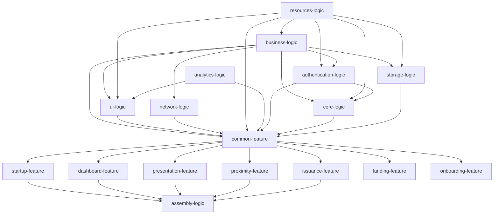

# Age Verification (AV) Android application

----

## Table of contents

* [Overview](#overview)
* [Demo videos](#demo-videos)
* [How to use the application](#how-to-use-the-application)
* [How to build - Quick start guide](#how-to-build---quick-start-guide)
* [How to update this fork](#how-to-update-this-fork)
* [License](#license)

## Overview

The Age Verification (AV) project is an Android app forked
from [EUDI Android Wallet reference application](https://github.com/eu-digital-identity-wallet/eudi-app-android-wallet-ui) ,
which is built based on
the [Architecture Reference Framework](https://github.com/eu-digital-identity-wallet/eudi-doc-architecture-and-reference-framework/blob/main/docs/architecture-and-reference-framework-main.md)  
and aims to showcase a robust and interoperable platform for digital identification, authentication, and electronic signatures based on common standards across the European Union.
The Age Verification (AV) Android Implementation is based on a modular architecture composed of
business-agnostic, reusable components that will evolve in incremental steps and can be re-used
across multiple projects.

The AV Android is the application that allows users to:

1. Obtain, store, and present age verification credentials.
2. Share age data on remote and proximity scenarios.

# 💡 Specifications Employed

The app consumes the SDK called EUDIW Wallet core [Wallet core](https://github.com/eu-digital-identity-wallet/eudi-lib-android-wallet-core) and a list of available libraries to facilitate remote presentation, proximity, and issuing test/demo functionality following the specification of the [ARF](https://github.com/eu-digital-identity-wallet/eudi-doc-architecture-and-reference-framework), including:
 
- OpenID4VP - draft 23 (remote presentation), presentation exchange v2.0,
 
- ISO18013-5 (proximity presentation),
 
- OpenID4VCI draft 14 (issuing)
 
- Issuer functionality, to support development and testing, one can access an OID4VCI test/demo service for issuing at: 

    - [Age Verification Issuer](https://issuer.ageverification.dev/)
 
Relying Party functionality:
 
To support development and testing, one can access a test/demo service for remote presentation at:

- [Age Verification Verifier](https://verifier.ageverification.dev/)

## Demo videos

Enrollment via National IDP

[Enrollment via National IDP](./wiki/enrollment-national-idp.mp4)


## How to use the application

### Minimum device requirements

- API level 28.

### Onboarding flow

1. You will be presented with the info pages that describe the app features.
2. You will be asked to confirm the privacy policy and terms of use.
3. You will be asked to create a PIN for future logins.
4. You will be asked to confirm your PIN.
5. You will be asked to choose a method to verify your age:
6. You will have to get a credential from a national idp (demo):

#### Get a credential from a national idp (demo)

1. Select the country you want to get the credential from.
2. You will be redirected to the national idp's website to login.
3. After successful login, you will be redirected back to the app.
4. You will be asked to confirm the credential offer you want to receive.

### Presentation (Online authentication/Same device) flow.

1. Go to the browser and enter "https://verifier.ageverification.dev/"
2. Expand the Age Over 18 card and select:
    1. "Attributes by" → "Specific attributes".
   2. "Format" → Choose the mdoc format.
3. Tap "Next", then select "Select Attributes".
4. Choose the fields you want to request from the Age Verification App (e.g., "Age Over 18").
5. Review your presentation request, tap "Next", and then select "Open with your Wallet" if you are
   using the same device as the Age Verification App otherwise open the AV app and click the Scan
   button.
6. When prompted to open the AV app, tap "Open".
7. You will be redirected to the app’s "Request" screen, where you can select or deselect which attributes to share with the Verifier. You must select at least one attribute to proceed.
8. Tap "Share".
9. Enter the PIN you set up during the initial steps.
10. Upon successful submission, tap "Close".
11. A browser will open, confirming that the Verifier has accepted your request.
12. Return to the app. The flow is now complete.


## How to build - Quick start guide

[This document](wiki/how_to_build.md) describes how you can build the application and deploy the issuing and verification services locally.

## Application configuration

You can find instructions on how to configure the application [here](wiki/configuration.md)

## Disclaimer

The released software is an initial development release version:

-  The initial development release is an early endeavor reflecting the efforts of a short time-boxed period, and by no means can be considered as the final product.  
-  The initial development release may be changed substantially over time and might introduce new features but also may change or remove existing ones, potentially breaking compatibility with your existing code.
-  The initial development release is limited in functional scope.
-  The initial development release may contain errors or design flaws and other problems that could cause system or other failures and data loss.
-  The initial development release has reduced security, privacy, availability, and reliability standards relative to future releases. This could make the software slower, less reliable, or more vulnerable to attacks than mature software.
-  The initial development release is not yet comprehensively documented. 
-  Users of the software must perform sufficient engineering and additional testing to properly evaluate their application and determine whether any of the open-sourced components are suitable for use in that application.
-  We strongly recommend not putting this version of the software into production use.
-  Only the latest version of the software will be supported

## Package structure

*assembly-logic*: App dependencies.

*build-logic*: Application gradle plugins.

*resources-logic*: All app resources reside here (images, etc.)

*analytics-logic*: Access to analytics providers. Capabilities for test monitoring analytics (i.e., crashes) can be added here (no functionality right now)

*business-logic*: App business logic.

*core-logic*: Age Verification core logic.

*storage-logic*: Persistent storage cache.

*authentication-logic*: Pin/Biometry Storage and System Biometrics Logic.

*ui-logic*: Common UI components.

*common-feature*: Code that is common to all features.

*dashboard-feature*: The application's main dashboard.

*startup-feature*: The initial screen of the app.

*presentation-feature*: Online authentication feature.

*issuance-feature*: Document issuance feature.

*proximity-feature*: Proximity scenarios feature.

*onboarding-feature*: Onboarding feature flow.

*landing-feature*: Landing Pagefeature.



## How to update this fork

Add Reference Implementation as a new remote (if not already added)

```bash
git remote add reference-implementation https://github.com/eu-digital-identity-wallet/eudi-app-android-wallet-ui.git
```

Create a new branch for the changes

```bash
git checkout -b update-from-reference-implementation
```

Pull the latest changes from the EUDI Wallet Reference Implementation.

```bash
git pull --no-rebase reference-implementation main
```

Resolve any merge conflicts, commit the changes and push the changes to the new branch.

Open a PR to merge the changes into development branch.

## License

### License details

Copyright (c) 2023 European Commission

Licensed under the EUPL, Version 1.2 or - as soon they will be approved by the European
Commission - subsequent versions of the EUPL (the "Licence"); You may not use this work
except in compliance with the Licence.

You may obtain a copy of the Licence at:
https://joinup.ec.europa.eu/software/page/eupl

Unless required by applicable law or agreed to in writing, software distributed under 
the Licence is distributed on an "AS IS" basis, WITHOUT WARRANTIES OR CONDITIONS OF 
ANY KIND, either express or implied. See the Licence for the specific language 
governing permissions and limitations under the Licence.
