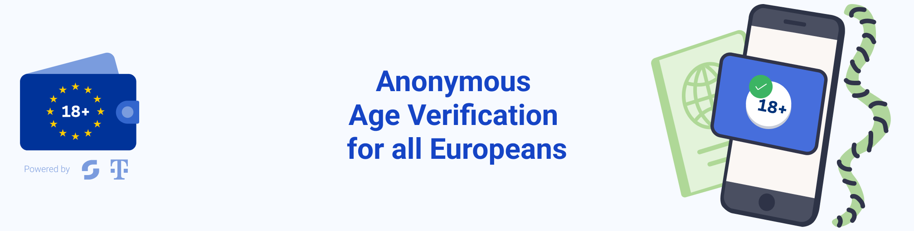

<!--
SPDX-FileCopyrightText: 2025 European Commission

SPDX-License-Identifier: Apache-2.0
-->

<h1 align="center">
    Age Verification (AV) Android application
</h1>

    
    
    

  <a href="#about">About</a> •
  <a href="#disclaimer">Disclaimer</a> •
  <a href="#development">Development</a> •
  <a href="#documentation">Documentation</a> •
  <a href="#support-and-feedback">Support</a> •
  <a href="#code-of-conduct">Code of Conduct</a> •
  <a href="#licensing">Licensing</a>

## About

The Age Verification (AV) android app is part of the Age Verification Solution Toolbox and serves as a component that can be used by memberstates, if necessary, to develop a national solution and build upon the building blocks of the toolbox.

This android app is forked from [EUDI Android Wallet reference application](https://github.com/eu-digital-identity-wallet/eudi-app-android-wallet-ui), which is built based on the [Architecture Reference Framework](https://github.com/eu-digital-identity-wallet/eudi-doc-architecture-and-reference-framework/blob/main/docs/architecture-and-reference-framework-main.md) and aims to showcase a robust and interoperable platform for digital identification, authentication, and electronic signatures based on common standards across the European Union.

The Age Verification (AV) Android Implementation is based on a modular architecture composed of business-agnostic, reusable components that will evolve in incremental steps and can be re-used across multiple projects.

The AV Android is the application that allows users to:

1. Obtain, store, and present an age verification attestation.
2. Share the proof of age attestation with online services to gain access.

## Dislaimer

This is an initial version of the software, developed solely for the purpose of demonstrating the business flow of the solution. It is not intended for production use, and does not yet include the full set of functional, security, or integration features required for a live deployment.

The current release provides only basic functionality, with several key features to be introduced in future versions, including:
 - Support for batch issuing
 - App and device verification based on Google Play Integrity API and Apple App Attestation
 - Additional issuance methods beyond the currently implemented eID based method. 

These planned features align with the requirements and methods described in the Age Verification Profile.

This version should be considered a foundational prototype to support early testing, feedback, and integration discussions.
- The initial development release may be changed substantially over time and might introduce new features but also may change or remove existing ones, potentially breaking compatibility with your existing code.
- The initial development release may contain errors or design flaws and other problems that could cause system or other failures and data loss.
- The initial development release has reduced security, privacy, availability, and reliability standards relative to future releases. This could make the software slower, less reliable, or more vulnerable to attacks than mature software.
- The initial development release is not yet comprehensively documented.
- Users of the software must perform sufficient engineering and additional testing to properly evaluate their application and determine whether any of the open-sourced components are suitable for use in that application.
- We strongly recommend not putting this version of the software into production use.
- Only the latest version of the software will be supported

## Development

### Specifications Employed

The app consumes the SDK called EUDIW Wallet core [Wallet core](https://github.com/eu-digital-identity-wallet/eudi-lib-android-wallet-core) and a list of available libraries to facilitate remote presentation and issuing test/demo functionality following partially the specification of the [ARF](https://github.com/eu-digital-identity-wallet/eudi-doc-architecture-and-reference-framework), including:
 
- OpenID4VP - draft 23 (remote presentation), presentation exchange v2.0,
 
- OpenID4VCI draft 14 (issuing)
  
### Build

Whether you cloned or downloaded the 'zipped' sources you will either find the sources in the chosen checkout-directory or get a zip file with the source code, which you can expand to a folder of your choice.

In either case open a terminal pointing to the directory you put the sources in. The local build process is described [here](./docs/how_to_build.md) and the configuration options are described [here](./docs/configuration.md).

> [!NOTE]
> The minimum device requirement for this application is  Android API level 28.

### Testing

To test the app, there is an issuer and verifier service available online. This allows you to perform the enrollment directly from within the app or via the online issuer in order to receive a proof of age attestation. With the verifier, you can then present this attestation.

- **Issuer functionality**, to support development and testing, one can access an OID4VCI test/demo service for issuing at: [Age Verification Issuer](https://issuer.ageverification.dev/)
 
- **Relying Party functionality:** To support development and testing, one can access a test/demo service for remote presentation at: [Age Verification Verifier](https://verifier.ageverification.dev/)

### How to release the app

To publish the app on the Google Play Store, several steps must be completed. A detailed description can be found [here](./docs/release_guide.md):

* **Create a Developer Account:** Register for a Google Play Developer account using your Google account. You will need to accept the developer distribution agreement and pay a one-time registration fee. If your app will offer in-app purchases or paid content, you must also set up a Google Payments merchant account.

* **Create a New Application:**  In the Google Play Console, select "All Apps" and click "Create App." Enter the app name and choose the default language and app type (app or game).

* **Complete the Store Listing:** Fill out all required information for your app’s store entry, including the app description, screenshots, icon, category, and contact details. The more information you provide, the better your app will be found in search results.

* **Upload the App Bundle (AAB) or APK:** Upload your app’s Android App Bundle (AAB) or APK file. Since August 2021, new apps must be published using the AAB format.

* **Content Rating:** Complete the content rating questionnaire to ensure your app is properly classified. Without this, your app may be removed from the Play Store.

* **Set Pricing and Distribution:** Decide whether your app will be free or paid, and select the countries in which it will be available. Note that you can change a paid app to free, but not vice versa.

* **Review and Launch:** Double-check all information and settings. Once everything is complete and all sections are marked as finished, confirm the release to submit your app for review. Google will review your submission, which can take several hours to a couple of days. After approval, your app will be published on the Play Store

## Documentation  

[Age Verification Solution Technical Specification](https://github.com/eu-digital-identity-wallet/av-doc-technical-specification)

## Support and feedback

The following channels are available for discussions, feedback, and support requests:

| Type                     | Channel                                                |
| ------------------------ | ------------------------------------------------------ |
| **Issues**    |   |
| **Other requests**    |    |

## Code of Conduct

This project has adopted the [Contributor Covenant](https://www.contributor-covenant.org/) in version 2.1 as our code of conduct. Please see the details in our [CODE_OF_CONDUCT.md](CODE_OF_CONDUCT.md). All contributors must abide by the code of conduct.

By participating in this project, you agree to abide by its [Code of Conduct](./CODE_OF_CONDUCT.md) at all times.

## Licensing

Copyright (C) 2025 European Commission, Scytales, T-Systems International GmbH and all other contributors.

This project follows the [REUSE standard for software licensing](https://reuse.software/). Each file contains copyright and license information, and license texts can be found in the [./LICENSES](./LICENSES) folder. For more information visit https://reuse.software/. You can find a guide for developers at https://telekom.github.io/reuse-template/.  

Unless required by applicable law or agreed to in writing, software distributed under the License is distributed on an "AS IS" BASIS, WITHOUT WARRANTIES OR CONDITIONS OF ANY KIND, either express or implied. See the LICENSES folder.
