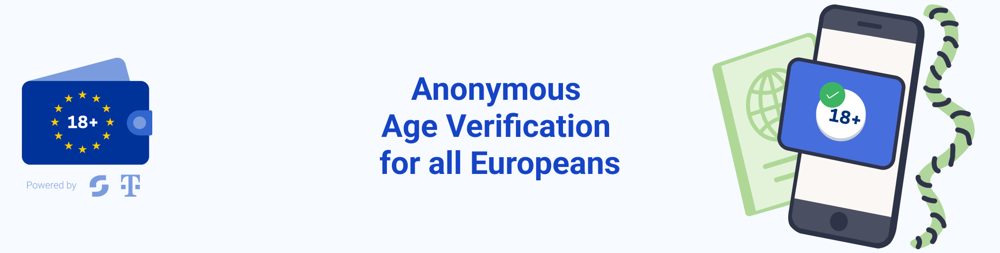

<!--
SPDX-FileCopyrightText: 2025 European Commission

SPDX-License-Identifier: Apache-2.0
-->

> [!IMPORTANT]
> The demo version is being updated.
> We will continue to release updates on the demo versions for community testing. 

<h1 align="center">
    Age Verification (AV) Android application
</h1>

  <a href="#about">About</a> •
  <a href="#development">Development</a> •
  <a href="#documentation">Documentation</a> •
  <a href="#support-and-feedback">Support</a> •
  <a href="#important-note">Important note</a> •
  <a href="#code-of-conduct">Code of Conduct</a> •
  <a href="#license">Licensing</a>

## About

The Age Verification (AV) android app is part of the Age Verification Solution Toolbox and serves as a component that can be used by Member States, if necessary, to develop a national solution and build upon the building blocks of the toolbox.

This android app is forked from [EUDI Android Wallet reference application](https://github.com/eu-digital-identity-wallet/eudi-app-android-wallet-ui), which is built based on the [Architecture Reference Framework](https://github.com/eu-digital-identity-wallet/eudi-doc-architecture-and-reference-framework/blob/main/docs/architecture-and-reference-framework-main.md) and aims to showcase a robust and interoperable platform for digital identification, authentication, and electronic signatures based on common standards across the European Union.

The Age Verification (AV) Android Implementation is based on a modular architecture composed of business-agnostic, reusable components that will evolve in incremental steps and can be re-used across multiple projects.

The AV Android is the application that allows users to:

1. Obtain, store, and present an age verification attestation.
2. Share the proof of age attestation with online services to gain access.

## Development

### Prerequisites

**Installation:**

### Specifications Employed

The app consumes the SDK called EUDIW Wallet core [Wallet core](https://github.com/eu-digital-identity-wallet/eudi-lib-android-wallet-core) and a list of available libraries to facilitate remote presentation and issuing test/demo functionality following partially the specification of the [ARF](https://github.com/eu-digital-identity-wallet/eudi-doc-architecture-and-reference-framework), including:

- OpenID4VP - v1 (remote presentation), DCQL

- OpenID4VCI v1 (issuing)
  
### Build

Whether you cloned or downloaded the 'zipped' sources you will either find the sources in the chosen checkout-directory or get a zip file with the source code, which you can expand to a folder of your choice.

In either case open a terminal pointing to the directory you put the sources in. The local build process is described [here](./docs/how_to_build.md) and the configuration options are described [here](./docs/configuration.md).

> [!NOTE]
> The minimum device requirement for this application is  Android API level 29.

### Testing

To test the app, there is an issuer and verifier service available online. This allows you to perform the enrollment directly from within the app or via the online issuer in order to receive a proof of age attestation. With the verifier, you can then present this attestation.

- **Issuer functionality**, to support development and testing, one can access an OID4VCI test/demo service for issuing at: [Age Verification Issuer](https://issuer.ageverification.dev/)
 
- **Relying Party functionality:** To support development and testing, one can access a test/demo service for remote presentation at: [Age Verification Verifier](https://verifier.ageverification.dev/)

### Videos

#### Issuance Flow

https://github.com/user-attachments/assets/893cdf19-982a-4646-ab70-3b1b186d706e

#### Presentation Flow

https://github.com/user-attachments/assets/e4701cbc-df0e-4bb2-9c34-3fa682630b6a

## Documentation  

[Age Verification Solution Technical Specification](https://github.com/eu-digital-identity-wallet/av-doc-technical-specification)

[Hardware-Backed Authentication](./docs/hardware_backed_authentication.md) - Biometric security configuration, device fallback behavior, and usability trade-offs.

## Support and feedback

The following channels are available for discussions, feedback, and support requests:

| Type                     | Channel                                                |
| ------------------------ | ------------------------------------------------------ |
| **Issues**    |   |
| **Discussion**    |   |
| **Other requests**    |    |

## Important note

This white-label application is a reference implementation of the Age Verification solution that should be customised before publishing it. 
The open-source blueprint gives you a working foundation, but it does not cover everything needed for a production deployment. Before going live, a number of technical tasks must be completed by the implementer — covering areas such as app hardening, secure storage, issuer setup, key management, issuance flow security, document-based enrolment, user authentication, and localisation.

A full description of each task is provided in the [Implementer Checklist](https://ageverification.dev/Getting%20started/app_implementers_tasks/).
Note that this checklist covers technical tasks only. Legal compliance, governance agreements, issuer registration on the AV Trusted List, and enrolment method validation are equally important and must be addressed in parallel.

Please note that this application is still under active development. It is regularly updated and new features and improvements are continuously being added.

## Code of Conduct

This project has adopted the [Contributor Covenant](https://www.contributor-covenant.org/) in version 2.1 as our code of conduct. Please see the details in our [CODE_OF_CONDUCT.md](CODE_OF_CONDUCT.md). All contributors must abide by the code of conduct.

By participating in this project, you agree to abide by its [Code of Conduct](./CODE_OF_CONDUCT.md) at all times.

## License

### License details

Copyright (c) 2025 European Commission

Licensed under the EUPL, Version 1.2 or - as soon they will be approved by the European
Commission - subsequent versions of the EUPL (the "Licence"); You may not use this work
except in compliance with the Licence.

You may obtain a copy of the Licence at:
https://joinup.ec.europa.eu/software/page/eupl

Unless required by applicable law or agreed to in writing, software distributed under 
the Licence is distributed on an "AS IS" basis, WITHOUT WARRANTIES OR CONDITIONS OF 
ANY KIND, either express or implied. See the Licence for the specific language 
governing permissions and limitations under the Licence.
